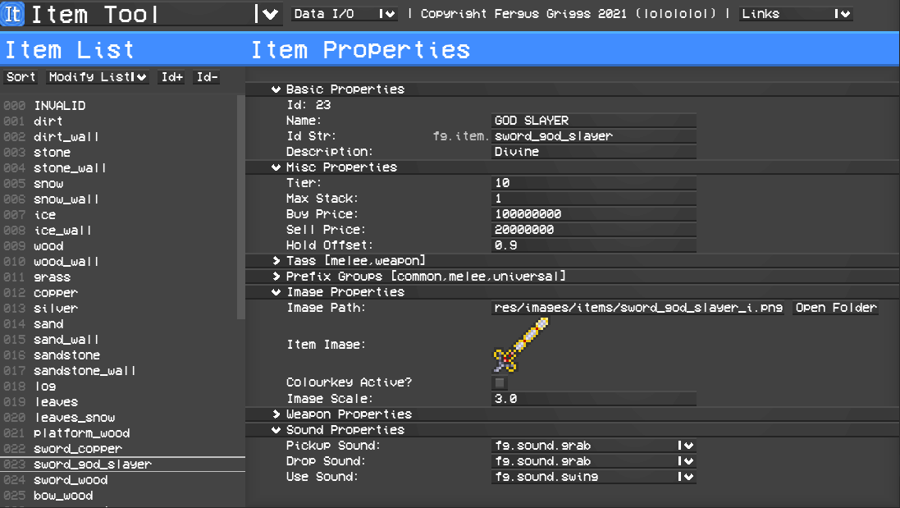

# FegariaTools

## About

This is a collection of tools that can be used to create data for Fegaria. It uses a custom UI system which allows for many kinds of user input and (hopefully) is good looking and easy to use. Most of the tools will export a data file and potentially a texture atlas image if images are part of the tool's data. These files can be dropped into the respective data and images folders in the Fegaria resources to give the game access to them.

## Crafting Tool
Not implemented yet.
## Entity Tool
Not implemented yet.
## Item Tool
The item tool allows for information about items to be changed including the name, description, tags and item image. Items can also be deleted, or new items can be created.

### Exports to
- **item_data.xml** data file
## Loot Tool

## Structure Tool

## Tile Tool

## Ai Tool
Not implemented yet.
## Sound Tool

## World Tool
## Projectile Tool
Not implemented yet.
## Wall Tool

